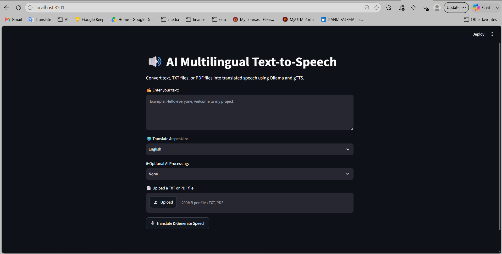
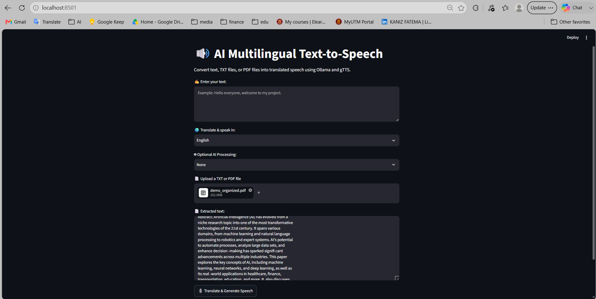
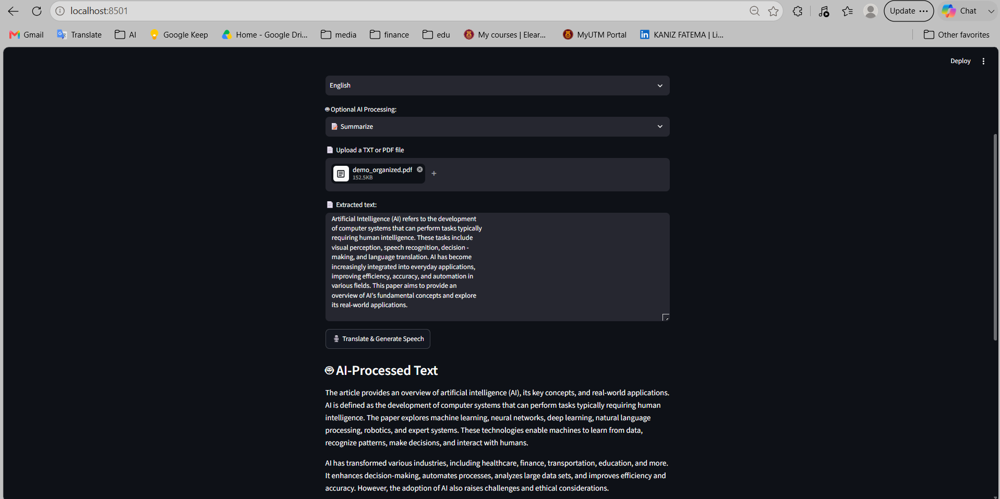
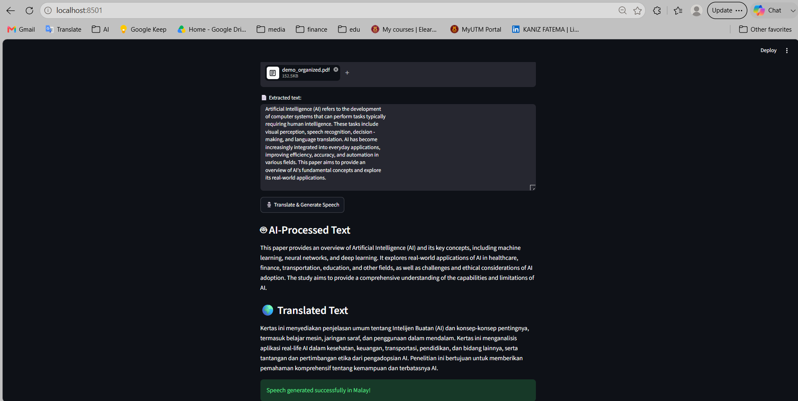
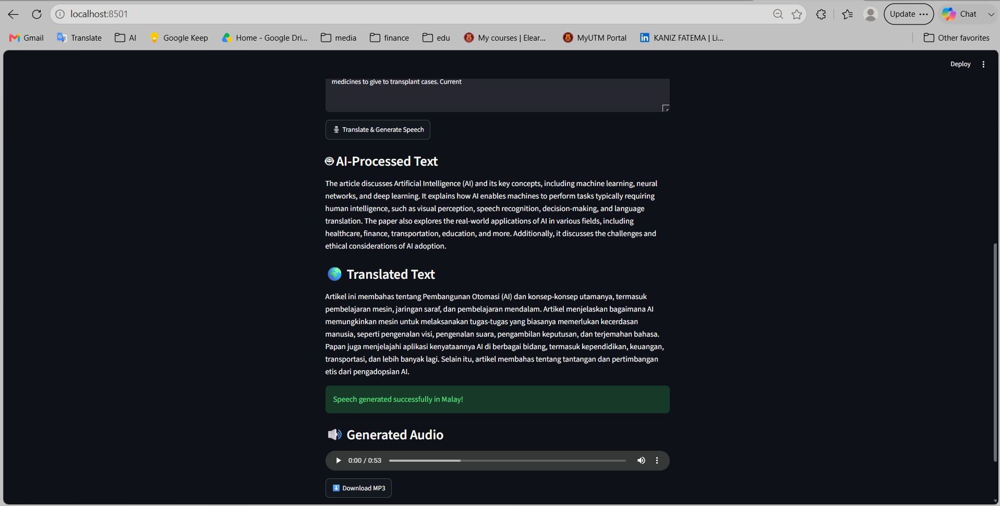

# 🔊 AI Multilingual Text-to-Speech

> **Transform text and documents into translated speech — powered by AI, Ollama, Llama 3.2, and gTTS.**

An AI-powered multilingual text-to-speech application built with **Python and Streamlit**. The application allows users to enter text or upload TXT/PDF documents, optionally enhance or summarize the content using **Llama 3.2:3B through Ollama**, translate it into multiple languages, and generate downloadable speech using **Google Text-to-Speech (gTTS)**.

---

## ✨ Why This Project?

Reading long documents can be time-consuming, especially when the content is written in a language that the user is less familiar with.

This project combines:

📄 **Document Processing**
🤖 **Local LLM Processing**
🌍 **AI Translation**
🔊 **Text-to-Speech**

into one simple interactive application.

### The idea is simple:

> **Upload → Understand → Translate → Listen**

---

# 🚀 Features

| Feature                     | Description                               |
| --------------------------- | ----------------------------------------- |
| ✍️ Text Input               | Enter text directly into the application  |
| 📄 PDF Support              | Extract text from PDF documents           |
| 📝 TXT Support              | Read `.txt` files                         |
| 🤖 AI Text Enhancement      | Improve the original text using Llama 3.2 |
| 📝 AI Summarization         | Generate concise summaries                |
| 🎭 Professional Rewriting   | Rewrite text in a professional tone       |
| 🌍 Multilingual Translation | Translate content into multiple languages |
| 🔊 Text-to-Speech           | Convert translated text into speech       |
| 🎧 Audio Preview            | Listen directly inside Streamlit          |
| ⬇️ MP3 Download             | Download generated speech                 |
| 🖥️ Interactive UI          | Simple browser-based interface            |

---

# 🌍 Supported Languages

Currently supported:

* 🇬🇧 English
* 🇲🇾 Malay
* 🇧🇩 Bengali
* 🇮🇳 Hindi
* 🇸🇦 Arabic
* 🇪🇸 Spanish
* 🇫🇷 French

The architecture can be extended to support additional languages supported by the translation model and gTTS.

---

# 🧠 AI Capabilities

The application provides three optional AI processing modes.

### ✨ Improve Text

Improves the readability of the original content while preserving its meaning.

### 📝 Summarize

Converts long content into a shorter and more concise version.

### 🎭 Make It Professional

Rewrites the content using a professional and natural writing style.

If the user selects:

```text
None
```

the original text is passed directly to the translation stage.

---

# 🏗️ System Architecture

```text
                         ┌─────────────────────┐
                         │       USER          │
                         └──────────┬──────────┘
                                    │
                                    ▼
                         ┌─────────────────────┐
                         │     Streamlit UI    │
                         └──────────┬──────────┘
                                    │
                    ┌───────────────┴───────────────┐
                    │                               │
                    ▼                               ▼
             ┌─────────────┐                ┌──────────────┐
             │ Text Input  │                │ PDF / TXT    │
             └──────┬──────┘                │ Upload       │
                    │                       └──────┬───────┘
                    │                              │
                    │                              ▼
                    │                       ┌──────────────┐
                    │                       │ PyPDF / File │
                    │                       │ Extraction   │
                    │                       └──────┬───────┘
                    │                              │
                    └──────────────┬───────────────┘
                                   ▼
                         ┌─────────────────────┐
                         │     Input Text      │
                         └──────────┬──────────┘
                                    │
                                    ▼
                         ┌─────────────────────┐
                         │ Optional AI Process │
                         │  Llama 3.2 : 3B     │
                         │      + Ollama       │
                         └──────────┬──────────┘
                                    │
                                    ▼
                         ┌─────────────────────┐
                         │    Translation      │
                         │ Llama 3.2 : 3B      │
                         └──────────┬──────────┘
                                    │
                                    ▼
                         ┌─────────────────────┐
                         │  Translated Text    │
                         └──────────┬──────────┘
                                    │
                                    ▼
                         ┌─────────────────────┐
                         │       gTTS          │
                         │ Text → Speech       │
                         └──────────┬──────────┘
                                    │
                                    ▼
                         ┌─────────────────────┐
                         │    MP3 Audio        │
                         │  Play + Download    │
                         └─────────────────────┘
```

---

# 🔄 Application Workflow

### Step 1 — Input

The user can either:

```text
Type text
      OR
Upload TXT
      OR
Upload PDF
```

---

### Step 2 — Text Extraction

For TXT files:

```python
file.read().decode("utf-8")
```

For PDF files:

```python
PdfReader(file)
```

The application loops through each page and extracts readable text.

---

### Step 3 — Optional AI Processing

The user can choose:

```text
None
Improve Text
Summarize
Make It Professional
```

If an AI mode is selected, the application sends the prompt to:

```text
Ollama
   ↓
Llama 3.2:3B
```

---

### Step 4 — Translation

The processed text is sent to the same local LLM.

The prompt instructs the model to:

```text
Translate the text
Keep the original meaning
Return only the translation
```

---

### Step 5 — Speech Generation

The translated text is passed to:

```text
gTTS
```

which generates:

```text
translated text
      ↓
MP3 audio
```

---

### Step 6 — Output

The user can:

🎧 Play the audio directly in the browser

or

⬇️ Download the generated MP3 file.

---

# 🛠️ Tech Stack

### Programming Language

🐍 Python

### Frontend / UI

🎨 Streamlit

### AI / LLM

🧠 Ollama
🦙 Llama 3.2:3B

### Document Processing

📄 PyPDF

### Text-to-Speech

🔊 Google Text-to-Speech (gTTS)

### File Handling

📁 Python `os`

---

# 📂 Project Structure

```text
AI-Multilingual-Text-to-Speech/
│
├── app.py
├── requirements.txt
├── README.md
├── .gitignore
│
└── audio/
    └── output.mp3
```

> `audio/output.mp3` is generated automatically when speech is created.

---

# ⚙️ Installation

## 1️⃣ Clone the Repository

```bash
git clone https://github.com/YOUR_USERNAME/YOUR_REPOSITORY.git
```

Move into the project:

```bash
cd AI-Multilingual-Text-to-Speech
```

---

## 2️⃣ Create a Virtual Environment

```bash
python -m venv venv
```

### Windows

```bash
venv\Scripts\activate
```

### macOS / Linux

```bash
source venv/bin/activate
```

---

## 3️⃣ Install Dependencies

```bash
pip install -r requirements.txt
```

Example `requirements.txt`:

```text
streamlit
gTTS
pypdf
ollama
```

---

# 🧠 Install Ollama

This application requires a local Ollama installation.

After installing Ollama, download the model:

```bash
ollama pull llama3.2:3b
```

Verify the model:

```bash
ollama list
```

You should see something similar to:

```text
llama3.2:3b
```

---

# ▶️ Run the Application

Start Streamlit:

```bash
streamlit run app.py
```

The application will open in your browser.

Typical local address:

```text
http://localhost:8501
```

---

# 🔌 How Ollama Works in This Project

The Python package:

```python
import ollama
```

acts as the Python client.

The actual architecture is:

```text
Streamlit
    │
    ▼
Python Ollama Client
    │
    ▼
Ollama Server
    │
    ▼
Llama 3.2:3B
    │
    ▼
AI Response
```

The application uses:

```python
ollama.chat(
    model="llama3.2:3b",
    messages=[
        {
            "role": "user",
            "content": prompt
        }
    ]
)
```

This allows the application to communicate with the local Llama model.

---

# 🔐 Privacy Advantage

One major advantage of using a local LLM is that the AI processing does not require sending the text to a commercial LLM API.

The architecture is:

```text
User
 ↓
Streamlit
 ↓
Ollama
 ↓
Local Llama 3.2
 ↓
Response
```

This can be useful when working with sensitive documents.

> However, PDF extraction and gTTS may involve their own processing/network behavior, so the application should not be described as completely offline.

---

# ⚠️ Current Limitations

No project is perfect. These are the current limitations of the application.

### 1. Local Ollama Dependency

The application requires Ollama to be installed and running.

Therefore, it is not a completely standalone web application.

---

### 2. Hardware Requirements

Running:

```text
Llama 3.2:3B
```

requires sufficient RAM and processing resources.

Performance depends heavily on the user's machine.

---

### 3. Cloud Deployment Complexity

The application cannot simply be deployed to a basic Streamlit hosting environment because the application requires:

```text
Streamlit
+
Ollama Server
+
Llama 3.2 Model
```

A deployment environment must be capable of hosting the LLM inference service.

---

### 4. Scanned PDFs

The current PDF extraction system uses:

```python
PdfReader
```

It works well with text-based PDFs but does not perform OCR.

Therefore:

```text
Normal PDF       → ✅
Scanned PDF      → ⚠️ Limited
Image-only PDF   → ❌
```

---

### 5. Long Documents

Very large documents can create extremely large prompts.

This may result in:

* slower processing
* increased memory usage
* incomplete responses
* context-window limitations

---

### 6. Translation Accuracy

The translation quality depends on the Llama 3.2 model.

Results may vary depending on:

* language
* document complexity
* technical terminology
* sentence structure
* document length

---

### 7. gTTS Dependency

Speech generation relies on gTTS.

Therefore, speech generation may require internet connectivity.

---

### 8. Audio File Handling

The current implementation stores the generated audio as:

```text
audio/output.mp3
```

Each new generation can overwrite the previous output.

---

# 🚧 Future Improvements

There are many ways this project can evolve.

## 🤖 Better LLM Architecture

Replace the local model with a configurable LLM layer:

```text
Ollama
OpenAI
Gemini
Claude
Other LLM APIs
```

This would make deployment easier and allow users to choose the model.

---

## 📄 OCR Support

Add OCR using tools such as:

```text
Tesseract
EasyOCR
PaddleOCR
```

This would allow the application to process scanned PDFs and images.

---

## 🧩 Document Chunking

Instead of sending an entire document to the LLM:

```text
Large Document
      ↓
Chunking
      ↓
Multiple Smaller Sections
      ↓
LLM Processing
      ↓
Combine Results
```

This would improve handling of large documents.

---

## 🧠 RAG Integration

A future version could implement:

```text
PDF
 ↓
Text Extraction
 ↓
Chunking
 ↓
Embeddings
 ↓
Vector Database
 ↓
Retriever
 ↓
LLM
 ↓
Answer / Summary / Translation
```

This would turn the application into a more powerful document intelligence system.

---

## 🎙️ Better Text-to-Speech

Replace or supplement gTTS with more advanced TTS systems that provide:

* natural voices
* multiple speakers
* voice selection
* emotion control
* better pronunciation
* adjustable speed

---

## 🎧 Audio Controls

Future versions could support:

```text
▶ Play
⏸ Pause
⏩ Speed
🔊 Volume
🎙️ Voice selection
```

---

## 🌐 More Languages

The language dictionary can be expanded to support additional languages.

---

## ☁️ Cloud Deployment

A future production architecture could separate the frontend and inference backend:

```text
                    Internet
                       │
                       ▼
              ┌─────────────────┐
              │ Streamlit Cloud │
              └────────┬────────┘
                       │
                       ▼
              ┌─────────────────┐
              │   AI Backend    │
              └────────┬────────┘
                       │
                       ▼
              ┌─────────────────┐
              │ LLM Inference   │
              └─────────────────┘
```

This would avoid requiring Ollama to run directly inside the Streamlit hosting environment.

---

# 🧪 Example Use Cases

### 🎓 Students

Convert lecture notes and study materials into audio.

### 🌍 Language Learning

Translate content and listen to pronunciation.

### 📚 Researchers

Convert research papers and documents into audio summaries.

### 💼 Professionals

Turn reports and documents into speech while working on other tasks.

### ♿ Accessibility

Provide an alternative way of consuming text-based information.

---

# 🎯 Learning Outcomes

Through this project, I explored:

* Python application development
* Streamlit web interfaces
* Local LLM integration
* Ollama
* Llama 3.2
* Prompt engineering
* PDF text extraction
* File processing
* Machine translation
* Text-to-speech systems
* Audio file generation
* Error handling
* Virtual environments
* Dependency management
* AI application architecture

Most importantly, the project helped me understand that building an AI application is not only about calling an LLM.

It also involves:

```text
Input
 ↓
Processing
 ↓
Prompt Design
 ↓
Model Inference
 ↓
Output Processing
 ↓
User Experience
 ↓
Deployment
```

---

# 💡 Key Technical Concepts

## LLM

A Large Language Model capable of understanding and generating human language.

---

## Ollama

A local runtime that allows LLMs to run on a personal computer.

---

## Llama 3.2

The language model used by this project for:

* text improvement
* summarization
* professional rewriting
* translation

---

## Streamlit

A Python framework used to create the interactive web interface.

---

## PyPDF

Used to extract text from PDF documents.

---

## gTTS

Google Text-to-Speech library used to convert translated text into audio.

---

# 🔄 End-to-End Example

Suppose the user uploads:

```text
research_paper.pdf
```

The application performs:

```text
research_paper.pdf
        ↓
     PyPDF
        ↓
 Extracted Text
        ↓
 Llama 3.2:3B
        ↓
    Summarize
        ↓
   Translation
        ↓
     Bengali
        ↓
      gTTS
        ↓
   output.mp3
        ↓
 🔊 Play / Download
```

---

# 📊 Current vs Future Architecture

### Current

```text
Streamlit
   │
   ├── PyPDF
   │
   ├── Ollama
   │      └── Llama 3.2:3B
   │
   └── gTTS
```

### Future

```text
Streamlit
    │
    ▼
Document Processing
    │
    ▼
OCR + Chunking
    │
    ▼
RAG / Vector Database
    │
    ▼
LLM Layer
    │
    ├── Ollama
    ├── Gemini
    ├── OpenAI
    └── Other Models
    │
    ▼
Translation
    │
    ▼
Advanced TTS
    │
    ▼
Audio Output
```

---

# 📸 Screenshots

## 🏠 Home Page



## 📄 PDF Upload & Text Extraction



## 🤖 AI Text Processing



## 🌍 Translation



## 🔊 Generated Audio




# 📌 Project Status

🟢 **Currently Working**

The current version supports:

* Text input
* TXT upload
* PDF extraction
* AI text enhancement
* Summarization
* Professional rewriting
* Translation
* Text-to-speech
* Audio playback
* MP3 download

---

# 🚀 Future Vision

The long-term goal is to transform this application from a simple text-to-speech utility into a complete **AI-powered multilingual document assistant**.

The envisioned system would allow users to:

```text
Upload any document
        ↓
Understand the content
        ↓
Ask questions
        ↓
Summarize
        ↓
Translate
        ↓
Generate natural speech
        ↓
Listen anywhere
```

---

# 👩‍💻 Author

**Kaniz Fatema**

Computer Science (Software Engineering) Student
Interested in **AI, Machine Learning, Automation, and Intelligent Applications**

### Connect

* 💼 LinkedIn: [MY LinkedIn Profile](https://www.linkedin.com/in/kaniz6228/)
* 🐙 GitHub: [My GitHub Profile](https://github.com/KANIZ6228/)

---

# ⭐ If You Find This Project Interesting

Feel free to:

⭐ Star the repository
🍴 Fork the project
💡 Suggest improvements
🐛 Report issues
🤝 Contribute

---

## 📜 License

This project is intended for educational and portfolio purposes.


---

<p align="center">

### 🔊 Text → 🤖 AI → 🌍 Translation → 🎙️ Speech

**Built with Python, Streamlit, Ollama, Llama 3.2 & gTTS**

</p>
